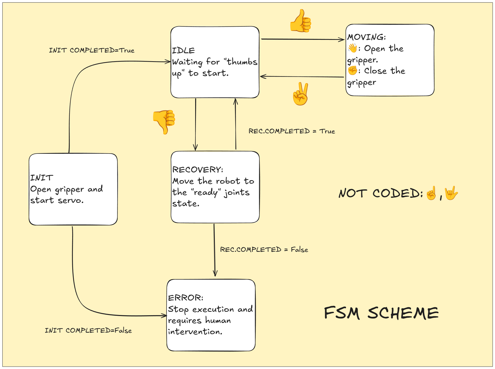

# Robot Teleoperation Using Hand-Tracking


## Introduction

This application enables intuitive robot teleoperation using real-time hand-tracking. It is structured as three ROS2 packages, all included in the local folder:

- **hand_tracker**: Uses Mediapipe to detect and publish hand pose and gesture data from a camera stream.
- **robot_teleoperation**: Receives hand-tracking data and translates gestures into robot control commands, enabling teleoperation.
- **dual_servo_arm**: Integrates with MoveIt2 to provide servo-based control for a dual-arm robot, executing the commands received from the teleoperation node.

By combining these packages, the system allows users to control a dual-arm robot through natural hand gestures, offering a modular and extensible approach to robot teleoperation.

## System Overview

### Image handling
The hand_tracker_node is a ROS2 node designed for hand tracking and gesture recognition using MediaPipe. It subscribes to a camera image topic, processes each frame to detect hand landmarks and gestures, and publishes both the raw detection data and annotated visualization images.

Key functionalities:
- Hand Detection and Landmark Extraction: Utilizes MediaPipe Hands to detect up to two hands per frame, extracting 21 normalized landmarks for each hand.
- Gesture Recognition: Integrates a MediaPipe gesture recognizer task to classify gestures such as Thumb_Up, Thumb_Down, Victory, Pointing_Up, Closed_Fist, Open_Palm, and ILoveYou.
- ROS Message Publishing: Publishes HandTrack messages separately for left and right hands, containing normalized 3D coordinates, gesture IDs, angles, and image metadata.

Pose and Angle Calculation:
- Pose: Computed as the mean position of key landmarks (wrist, base of the index finger, and base of the pinky) to estimate hand position relative to the image. The x-coordinate is adjusted for left hands, and all coordinates are normalized to the range [-1, 1] to fit a standardized reference frame.
- Angle: Calculated as the planar angle between the vector from the wrist to the middle of the palm and a reference horizontal vector. The angle is normalized to account for coordinate system differences and ensures consistent orientation representation across different hands and frames.

### FSM Diagram
The teleoperation make use of servo node implemented by moveit to handle the control of the robot. The signal from the hand_tracker, in range [-1,1] is multiplied by the **vel_\{lin/angle\}_gain** to obtain the final velocity published as `TwistStamped` in the `servo_node`.
Since the value can be noisy, a class `TwisterSmoother` is added to implement a moving-average of the input to send a smoother signals to the node.
Additionally, vector of the normalized value of the velocities coming from the `hand_tracker` should exceed the given value `clip_radius`, this modification has been made to avoid the sending of a command if the hand is standstill in the central position.

The following diagram illustrates the high-level finite state machine (FSM) scheme for the teleoperation system:




## Installation
## Binary Install
Starting from a ROS2 Humble installation, install the remaining additional packages to be installed can be found in "install.sh" file.
Mediapipe installation is handled by pip and is tested with python 3.10.
I used "python-is-python3" to avoid to specify the python version, so adjust accordingly in case of difference

Additional information about the installation can be found in the respective link of the projects.
- [ROS2 Humble](https://docs.ros.org/en/humble/Installation.html)
- [MoveIt](https://moveit.picknik.ai/humble/doc/tutorials/getting_started/getting_started.html)
- [Mediapipe](https://ai.google.dev/edge/mediapipe/solutions/guide?hl=en)

### Docker
As alternative run the process using a docker container. The docker can be build and run using provided bash script.
```
bash docker_build.sh
bash docker_run.sh
```
The original image used to build the docker is [ros:humble-desktop](https://hub.docker.com/layers/osrf/ros/humble-desktop-full/images/sha256-71ae08a6a0aae71a2f981e066c8a1d7dd76e956abf419c04626a0c746c3ebf4f)

If rviz is not visibile, allow X server connections from local user:
```
xhost +local:docker
```

## How to Run
The application is composed by three launch files required to be launched:
Activate the camera, the hand_tracking publisher and rqt for visualization
```
ros2 launch hand_tracker hand_tracker.launch.py
```
Start the moveit servo node, after this Rviz should appear and the robot should be visibile
```
ros2 launch robot_teleoperation dual_servo_arm.launch.py 
```
Start the teleoperation application. The launch files launch two nodes one for each robot.
```
ros2 launch robot_teleoperation teleoperation.launch.py
```


## Final Comments
Some final comments on the implementation choise:
- I choose python for the implementation for convenience. Is actually only required by mediapipe
- A problem related to python is that ComposableNode are not available for .py scripts. 
- I used two panda robot with 7DOF instead of 6DOF
- Given the need of ROS, I thought to test servo_node integration by moveit. In this way we already have the joint state publishing and also a joint/pose controller with obstacle avoidance
- I had some trouble with my camera, and even reducing the resolution, it capped the framerate to 10FPS. I decide to focus on other stuff rather than solve it.


## Acknowledgments

This project makes use of the following open-source resources:
- [ROS2](https://github.com/ros2) — Main framework  
- [Mediapipe](https://ai.google.dev/edge/mediapipe/solutions/guide) by Google — Used for the hand tracking and gesture recognition.  
- [Moveit2](https://github.com/moveit/moveit2) by PickNik Robotics — Used to handle the servo control.